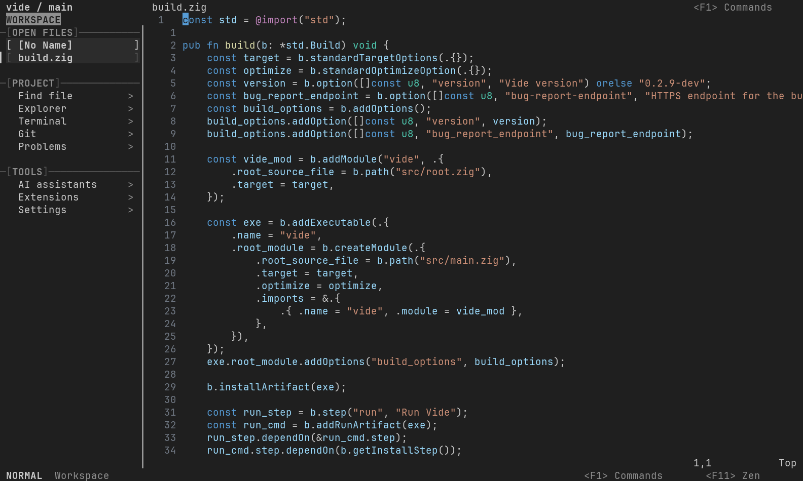
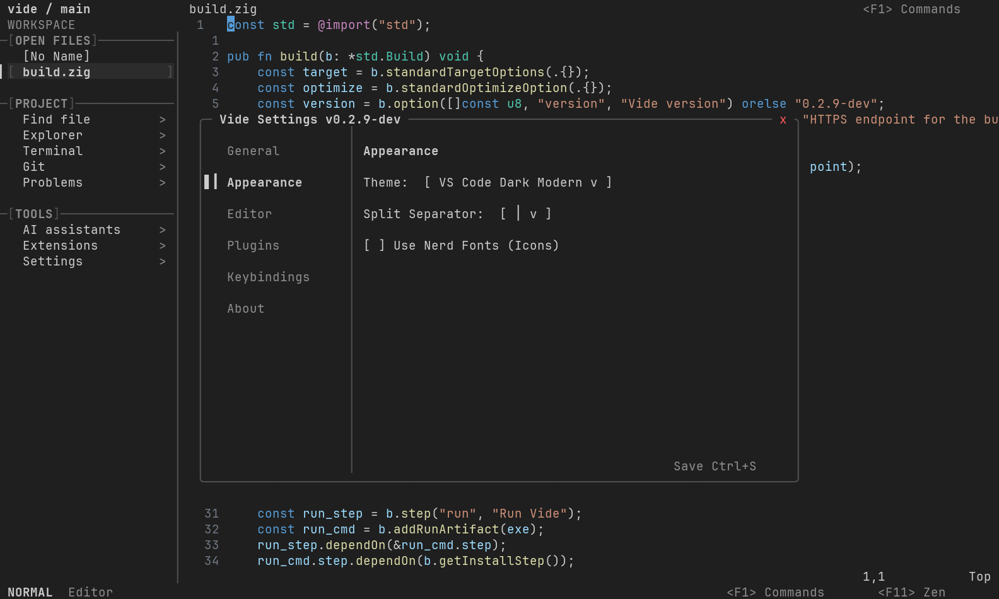
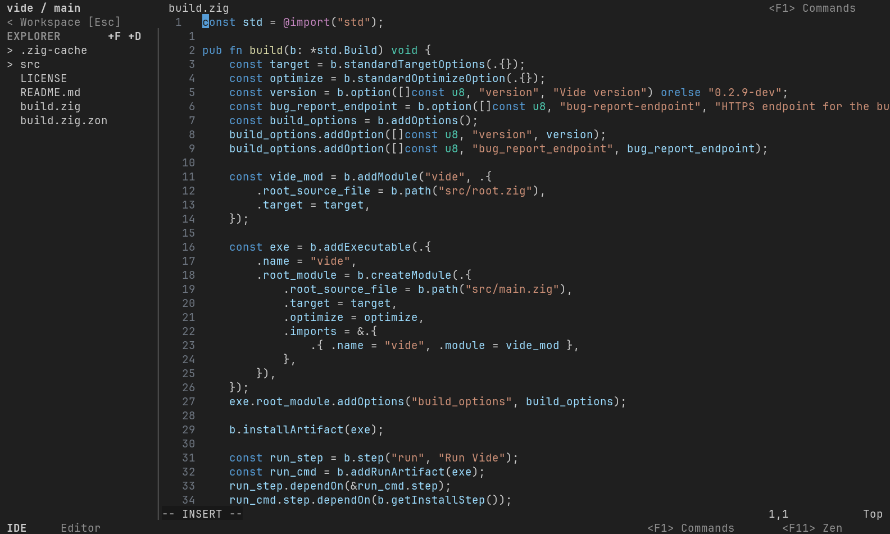

<div align="center">

```
                  ██╗   ██╗██╗██████╗ ███████╗
                  ██║   ██║██║██╔══██╗██╔════╝
                  ██║   ██║██║██║  ██║█████╗
                  ╚██╗ ██╔╝██║██║  ██║██╔══╝
                   ╚████╔╝ ██║██████╔╝███████╗
                    ╚═══╝  ╚═╝╚═════╝ ╚══════╝
```

**The IDE that hides a terminal. The terminal that wears an IDE.**

[](LICENSE)


</div>

---

> [!NOTE]
> Linux is the primary tested platform. macOS and WSL are supported targets and
> are being hardened across a broad range of terminal emulators.

---

## What is Vide?

Vide is a terminal-native Integrated Development Environment with a Zig frontend and Neovim as its editing engine. Its bundled editor configuration is written in Lua, and the extension shop uses a small Python helper.

**The power of a professional IDE, presented through a terminal-native interface.**

### Current Interface

| Normal mode | Native settings | IDE mode |
| --- | --- | --- |
|  |  |  |

Additional reproducible captures cover [Normal mode](docs/media/normal.svg),
[Zen mode](docs/media/zen.svg), [Git](docs/media/git.svg),
[live diagnostics](docs/media/diagnostics.svg), and
[completion](docs/media/completion.svg).
The [Extension Shop](docs/media/extensions.svg) capture is generated from the
cached real catalog rather than placeholder entries.
Asciinema-compatible `.cast` recordings and the reproducible capture command
are documented in [Generated Vide media](docs/media/README.md).
The repository root also contains the lightweight, responsive
[Vide product website](index.html), deployed automatically through GitHub Pages.
Machine-specific startup, redraw, large-file, large-directory, and plugin
measurements are recorded in [Performance profiling](docs/performance.md);
Vide does not present them as universal performance guarantees.

Vide eliminates the false choice between GUI IDEs and terminal editors. You get full IDE capabilities — an integrated file explorer, an integrated terminal panel, real-time diagnostics, and a configuration interface — wrapped in a high-performance, lightweight terminal application. No bloat. No Electron. No configuration hell.

### Why Choose Vide?

- **Terminal-native:** Vide has no GUI framework or Electron runtime and works over SSH in a capable terminal.
- **Responsive by design:** The Zig frontend uses a double-buffered terminal renderer and Neovim's embedded UI protocol.
- **Neovim-powered and isolated:** Vide ships its own defaults and plugin environment. Plugins installed inside Vide remain separate from your system Neovim setup.
- **Unified Workflow:** Mouse-driven file navigation, integrated terminal, and Neovim all share the same window. No task switching, no terminal juggling. Work naturally with keyboard or mouse.
- **Complete Independence:** Vide uses its own configuration directory and never interferes with your system Neovim setup. Run both side by side.

---

## Architecture

Vide operates as a unified Terminal User Interface (TUI).

Instead of wrapping a terminal emulator or launching multiple discrete processes, Vide handles all terminal rendering directly via a highly optimized, double-buffered drawing engine written in Zig.

Neovim is launched as a hidden, headless subprocess using its native `--embed` protocol. Vide intercepts Neovim's UI commands via Msgpack-RPC and paints them onto the terminal, seamlessly integrating Neovim's power with custom native components.

This architecture ensures:
* **Isolated Configuration:** Vide sets `NVIM_APPNAME=vide`, keeping its Neovim configuration, plugins, state, and cache in Vide-specific XDG directories instead of your system Neovim directories.
* **Unified Interactions:** Mouse clicks and scrolls span naturally across native Zig components (like the file tree) and Neovim buffers.
* **Minimal Runtime:** The Vide binary embeds its frontend runtime. Neovim is required, while Git and Python enable Git integration and the extension shop.

---

## Core Features

### Three Editing Modes
Vide provides three distinct experiences without changing editor engines:
* **Normal Mode:** Vide's complete TUI with native widgets, mouse support, and unrestricted Neovim modes and keybindings.
* **Zen Mode:** The embedded Neovim UI fills the terminal viewport and all Vide widgets disappear. An optional native-Neovim handoff can be enabled in settings.
* **IDE Mode:** The same approachable TUI as Normal Mode, with Neovim constrained to modeless, text-area-style editing for users coming from editors such as VS Code.

The active mode appears at the left of Vide's bottom mode row. Click that badge
to open the mode selector. Zen removes all other Vide chrome; press F11 to
return to the exact Normal or IDE mode that was active before entering Zen.

### First Run

On its first launch, Vide opens an offline-capable onboarding guide. Choose
Normal or IDE editing, review detected color, mouse, Nerd Font preference,
clipboard, and shell capabilities, and learn the essential mouse actions and
six core shortcuts. Language-server setup is offered through Mason but remains
optional. Dismiss the guide with `q` or Escape; reopen it from the Help page by
pressing `o`, or run `:VideOnboarding`. The choice and completion marker are
stored only in Vide's isolated data directory.

### Native Zig Components
The surrounding UI elements are built natively in Zig for maximum speed and memory efficiency:
* **Interactive File Explorer:** Directly queries the filesystem (`std.fs`), supporting mouse-driven navigation, directory expansion, and real-time Git/Neovim modification indicators.
* **Package Management Widgets:** Custom, full-screen TUI interfaces for both the Lazy plugin manager and the Mason package registry, featuring real-time search filtering and mouse control.
* **Configuration Menu:** A dedicated GUI-like settings panel for adjusting themes, indentation, line numbers, and keybindings on the fly.

### Neovim Editor Engine
Vide bundles support for LSP, Treesitter, Telescope, completion, Mason, and other editor tooling. Compatibility can vary for plugins that assume they own the outer terminal UI; plugins should be installed and configured inside Vide's isolated environment.

See [Plugin compatibility](docs/plugin-compatibility.md) for ownership rules,
the tested bundled-plugin list, unsupported plugin categories, and the local
smoke-test command.

Recorded terminal observations and the reproducible host/tmux runner are in
[Terminal compatibility smoke tests](docs/terminal-compatibility.md).
Use `tests/terminal_compat.sh ssh` to repeat the isolated real-SSH transport.

---

## Installation

### Prerequisites

Before installing Vide, make sure you have the following:

| Dependency | Minimum Version | Notes |
| :--- | :--- | :--- |
| **Neovim** | `>= 0.10.0` | Required as the editor engine |
| **Zig** | `0.16.0` | Exact supported version for reproducible source builds |
| **git** | any | Required to clone the repository |
| **curl** | any | Required by `setup.sh` |
| **Python** | `>= 3` | Required by the extension shop and automatic Zig installation |
| **A Nerd Font** | optional | Enables richer icons; portable text symbols are used by default |
| **True Color terminal** | — | Any modern terminal (Alacritty, Kitty, Ghostty, etc.) |

> [!IMPORTANT]
> Vide manages its own isolated Neovim configuration under `~/.config/vide`. It will **not** modify your existing Neovim setup.

---

### Quick Install (Recommended)

Run the one-line installer. It will automatically:

1. Detect missing or outdated runtime dependencies
2. Ask before changing system packages
3. Download the latest supported release binary
4. Install it to `~/.local/bin/vide`
5. Create VIDE's isolated Neovim directories
6. Bootstrap all Neovim plugins headlessly

```bash
curl -fsSL https://raw.githubusercontent.com/Rouboufy/vide/main/setup.sh | bash
```

Installer options include `--dry-run`, `--no-plugins`, `--source`, and `--yes`.
When input is not interactive, the installer refuses to change system packages
unless `--yes` is supplied. Release binaries are preferred; use `--source` for
an explicit source build or on a platform without a published binary. Source
builds require the pinned Zig version to be installed first. Automatic package
installation supports apt, pacman, dnf, zypper, and Homebrew and installs only
dependencies detected as missing or too old.

Tagged releases provide checksum-verified binaries for Linux x86-64 and ARM64,
and macOS Intel and Apple Silicon. The installer selects the matching asset,
verifies it against the release's `SHA256SUMS`, and replaces the installed
binary atomically. Neovim is required on the host and is not embedded in these
archives. Source compilation remains available through `--source` for
development and unsupported targets.

After installation, run:

```bash
vide
```

Print the installed build version without starting the TUI or Neovim:

```bash
vide --version
```

The Settings panel's About tab shows the Vide and running Neovim versions plus
the active data, settings, and log paths.

> [!TIP]
> If `vide` is not found after installation, add `~/.local/bin` to your `PATH`:
> ```bash
> echo 'export PATH="$HOME/.local/bin:$PATH"' >> ~/.bashrc && source ~/.bashrc
> ```

---

### Manual Build

If you prefer to build from source yourself:

```bash
# 1. Clone the repository
git clone https://github.com/Rouboufy/vide.git
cd vide

# 2. Build the binary (requires Zig 0.16.0 exactly)
zig build -Doptimize=ReleaseFast

# 3. Run Vide directly
./zig-out/bin/vide

# 4. (Optional) Install the binary globally
cp ./zig-out/bin/vide ~/.local/bin/vide

```

### Update

If you installed Vide from source, update it by pulling the repository and
rebuilding:

```bash
git -C ~/path/to/vide pull --ff-only
cd ~/path/to/vide
zig build -Doptimize=ReleaseFast
```

If you installed via `setup.sh`, rerun the installer from the same repository
checkout or reinstall from a fresh clone. Vide keeps user settings and plugin
state in its own XDG directories, so normal updates should not touch them.

If you are using the AppImage packaging script, the resulting image bundles a
pinned Neovim 0.11.6 runtime inside the AppDir; host Neovim is not required for
this package. It records the Vide version, commit, architecture, and bundled
Neovim version in `VERSION.txt`, includes desktop/icon/AppStream metadata, and
publishes a neighboring `.sha256` checksum. Native archive installations use
the host Neovim instead.
See [AppImage packaging and verification](docs/appimage.md) for reproducible
commands and recorded distribution smoke tests.

### Uninstall

Remove the binary and, if desired, Vide's local data:

```bash
rm -f ~/.local/bin/vide
rm -rf ~/.config/vide ~/.local/share/vide ~/.local/state/vide ~/.cache/vide
```

If you want to keep settings, remove only `~/.local/bin/vide` and leave the
XDG directories in place.

---

## Default Keybindings

### TUI Interface Controls

These keybindings are handled directly by the Vide TUI layer:

| Action | Keybinding |
| :--- | :--- |
| **Toggle Zen / previous mode** | `F11` |
| **Toggle File Explorer** | `Ctrl + E` |
| **Toggle Terminal Panel** | `Ctrl + T` |
| **Resize Panel Left** | `Alt + ←` |
| **Resize Panel Right** | `Alt + →` |
| **Resize Panel Up** | `Alt + ↑` |
| **Resize Panel Down** | `Alt + ↓` |

### Neovim / Editor Keybindings

These shipped mappings apply primarily in Normal mode (`Leader = Space`). IDE mode intentionally changes editing behavior.

| Action | Keybinding |
| :--- | :--- |
| **Save file** | `Ctrl + S` |
| **Force quit Vide** | `Ctrl + Q` |
| **Open new buffer** | `Ctrl + N` |
| **Find files (Telescope)** | `Space f f` or `Ctrl + F` |
| **Live grep (Telescope)** | `Space f g` |
| **Toggle Neo-tree** | `Space e` |
| **Toggle bottom terminal split** | `Space o t` |
| **Toggle vertical terminal split** | `Space o Shift+T` |
| **Create horizontal editor split** | `Ctrl + W`, then `S` |
| **Create vertical editor split** | `Ctrl + W`, then `V` |
| **Move between editor splits** | `Ctrl + W`, then `H`, `J`, `K`, or `L` |
| **Close current editor split** | `Ctrl + W`, then `Q` |
| **Open editor settings** | `Space t h` |
| **Delete without yanking** | `Space d` |
| **Substitute word everywhere** | `Space s` |
| **Paste over selection** | `Space p` (Visual) |
| **Scroll half page down (centered)** | `Ctrl + D` |
| **Scroll half page up (centered)** | `Ctrl + U` |
| **Move lines down** | `J` (Visual) |
| **Move lines up** | `K` (Visual) |

> [!NOTE]
> Core TUI keybindings—including Ctrl+E, Ctrl+T, F11, Ctrl+N, Ctrl+F, and Ctrl+Q—can be customized in Vide's native Settings panel. Editor-level mappings can differ between Normal and IDE modes.

In IDE mode, Shift+Arrow extends the selection, Ctrl/Cmd+Shift+Left or Right
selects by word, and Ctrl/Cmd+A selects the buffer. Ctrl/Cmd+S, Z, C, X, and V
provide save, undo, copy, cut, and paste; Ctrl+Y or Ctrl/Cmd+Shift+Z redoes.
Ctrl+L selects the current line. Ctrl/Cmd+F opens buffer search and Ctrl+H
(Cmd+R on terminals that report it) opens replace. Home, End, Ctrl+Arrow, mouse
click, and mouse drag use Neovim's terminal-native navigation and selection.
Some terminals cannot distinguish Cmd from Alt or report shifted modifiers;
Vide keeps the Ctrl form available and uses the terminal capability fallback.
The IDE status row also provides mouse-accessible File, Edit, Selection, and
Buffer menus for the same actions; these remain available when a terminal does
not report a desktop shortcut distinctly.
Escape and incidental mode changes return editable file buffers to text-entry
mode. Dialogs, terminals, help pages, and plugin-owned utility buffers keep
their native keys and modes so their own escape routes continue to work.

The Editor tab in Settings controls the optional column ruler. It defaults to
Off and provides validated presets for columns 80, 100, 120, and `80,120`.
Changes apply immediately to current and new file windows. Dashboards,
terminals, help, settings, and other non-file buffers never show the ruler.

### Language Tools

Vide detects common project markers for Zig, Lua, Python, Rust,
JavaScript/TypeScript, Go, and C/C++, then recommends only the matching Mason
language servers. Projects without recognized markers remain manual rather
than installing unrelated tools. Open Settings > Plugins > Mason Settings for
the health summary, active servers, recommended packages, missing executables,
and installed LSP/formatter/linter status. Missing or failed tooling is also
reported through native notices with details in the Vide log.

### Accessibility and Terminal Fallbacks

All primary controls are keyboard accessible; sidebar lists show their
navigation keys and focused controls use both color and a visible marker or
inverse background. Vide supplies text-symbol alternatives when Nerd Fonts are
disabled and keeps keyboard routes available when mouse reporting is absent.
Dialogs show explicit empty, loading, success, and error messages, and compact
terminals receive a resize instruction instead of clipped or unsafe layouts.
The default theme is regression-tested for readable primary, secondary,
status-bar, and focused-control contrast.

## Troubleshooting

- **`vide` is not found:** ensure `~/.local/bin` is on your `PATH`.
- **Neovim is too old:** Vide requires Neovim `0.10.0` or newer.
- **Wrong Zig version:** reproducible source builds require Zig `0.16.0`
  exactly. CI uses the same stable release; arbitrary master snapshots are not
  supported.
- **Clipboard does not work:** install a terminal clipboard provider or use a
  terminal and desktop session that exposes clipboard integration.
- **Icons look broken:** install a Nerd Font or switch to portable text
  symbols in settings.
- **Plugins fail to bootstrap:** check `~/.local/share/vide/vide.log` (or the
  data path shown in Settings > About) and
  retry after confirming network access. Use `VIDE_DISABLE_PLUGINS=1 vide` for
  a recovery startup that skips all plugin loading without deleting plugin
  files. In Settings > Plugins > Plugin Manager, press `s` to retry bootstrap
  and synchronization.
- **tmux or SSH input feels limited:** some terminals cannot distinguish all
  modifier combinations or mouse protocols; use the most capable terminal
  available for that path.
- **macOS or WSL behaves differently:** those platforms are supported, but the
  terminal and filesystem integration differs from Linux and may require
  terminal-specific adjustments.

## Limitations

Vide detects true-color hints, SGR mouse suitability, bracketed-paste support,
Linux console/dumb terminals, and tmux-style ambiguous modifier paths. It uses
the 256-color palette when true color is unavailable, disables unsupported
mouse/paste protocols, defaults to portable non-Nerd-Font symbols, and keeps
keyboard access available. Explicit terminal and user settings remain
authoritative because terminals cannot reliably prove font glyph coverage or
every modified-key capability.

- Neovim remains a required runtime dependency.
- Some plugins assume ownership of the outer terminal UI and are not a good
  fit for Vide's embedded TUI.
- Terminal capabilities vary by emulator, shell, multiplexers, and remote
  transport.
- IDE mode is intentionally more constrained than Normal mode and does not aim
  to replicate every Vim interaction.

## Data Locations

Vide stores its state in isolated XDG directories:

- `~/.config/vide` for configuration
- `~/.local/share/vide` for plugins, data, and bundled runtime content
- `~/.local/state/vide` for sessions and stateful runtime files
- `~/.cache/vide` for transient caches and generated artifacts

These directories are separate from the user's standard Neovim locations.

---

## Contributing

Contributions are welcome. The prioritized roadmap and completion criteria are
tracked in [TODO.md](TODO.md). Component responsibilities, process boundaries,
and storage ownership are described in
[vide_architecture.md](vide_architecture.md).

### Build and Test

Vide pins Zig `0.16.0` in the package manifest, CI, installer, and contributor
documentation. Change that pin only as a coordinated toolchain upgrade after
the full test suite and release packaging pass. A language migration is not a
current roadmap commitment; it should only be considered after measuring build
reproducibility, portability, binary size, maintenance effort, and renderer
performance.

- `zig build`
- `zig build run`
- `zig build test`
- `zig fmt --check build.zig src/main.zig src/nvim/ui_protocol.zig src/tui/renderer.zig`
- `shellcheck setup.sh update.sh uninstall.sh build_appimage.sh`
- `bash tests/setup_plans.sh`
- `python3 tests/pty_integration.py` after `zig build`

Pull requests run these checks in CI, exercise apt, pacman, dnf, zypper,
Homebrew, and WSL installer plans, validate Markdown links, and compile
x86-64 and ARM64 Linux musl targets. They also run the full host PTY suite on
macOS. A manual self-hosted workflow records the same suite inside real WSL.
Cross-compilation confirms that artifacts
build; platform support claims still require the smoke tests tracked in the
roadmap.

### Release Procedure

The current release path is source-based. For a release candidate:

1. Update the versioned documentation and changelog material.
2. Run the test suite.
3. Build optimized binaries with `zig build -Doptimize=ReleaseFast`.
4. Verify the binary on supported platforms before publishing.

## License

Vide is released under the MIT License. See `LICENSE` for details.
