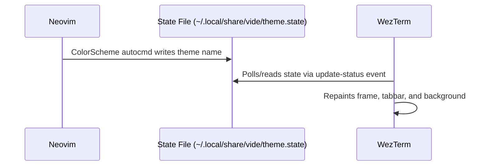
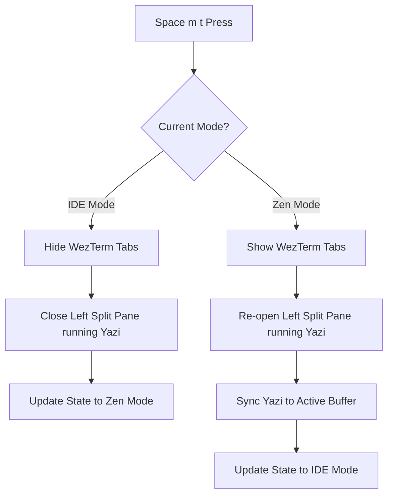

# 🗺️ Vide — Development Roadmap

This document outlines the detailed step-by-step roadmap for building **Vide**, an integrated development environment combining **WezTerm**, **Neovim**, and **Yazi**.

---

## 🏗️ Phase 1: Foundation & Sandboxing
**Goal:** Set up isolated configurations for all three components to ensure Vide does not conflict with any existing dotfiles on the user's system.

### 1.1 Launcher Script (`bin/vide`)
- [ ] Create a launch wrapper script that override-defines:
  - `XDG_CONFIG_HOME="$HOME/.config/vide"`
  - `NVIM_APPNAME="vide-nvim"`
  - `YAZI_CONFIG_HOME="$HOME/.config/vide/yazi"`
- [ ] Ensure the script starts WezTerm and automatically boots Neovim.
- [ ] Implement command line argument forwarding (`vide [file/folder]`).

### 1.2 Isolated Configuration Structures
- [ ] Setup config directory skeleton:
  ```
  ~/.config/vide/
  ├── wezterm/
  │   └── wezterm.lua
  ├── vide-nvim/
  │   ├── init.lua
  │   └── lua/
  │       └── config/
  └── yazi/
      └── yazi.toml
  ```

### 1.3 Key Dependencies Setup
- [ ] Define installer validation checks for:
  - Neovim $\ge$ 0.10.0 (required for floats and terminal/RPC features).
  - WezTerm (latest release).
  - Yazi + `ya` CLI helper.

---

## 🎨 Phase 2: Theme Synchronisation
**Goal:** Create a unified visual styling. Changing the colorscheme inside Neovim must dynamically repaint the WezTerm window border, tabbar, and background.



### 2.1 Neovim Theme Event Hook
- [ ] Implement `ColorScheme` autocommand inside Neovim (`lua/config/autocmds.lua`).
- [ ] Write theme details (palette configuration / colorscheme name) to `$XDG_DATA_HOME/vide/theme.state`.

### 2.2 WezTerm Dynamic Palette Loader
- [ ] Configure WezTerm to read from `theme.state` during status update ticks.
- [ ] Map Neovim themes (e.g., Catppuccin, TokyoNight, Gruvbox) to corresponding WezTerm palettes.
- [ ] Remove native titlebars (`window_decorations = "NONE"`) and implement premium visual configurations (glassmorphism/opacity, subtle borders).

---

## 🌳 Phase 3: Split Panes & Yazi Integration
**Goal:** Implement the IDE-style pane split, spawning the file tree on the left side and Neovim on the right side under WezTerm.

### 3.1 Startup Window Split (WezTerm)
- [ ] Configure WezTerm startup script to:
  1. Boot the terminal workspace.
  2. Split the window horizontally: Left split (15% width) runs `yazi`, Right split (85% width) runs `nvim`.
  3. Ensure focus goes to the Neovim pane by default.

### 3.2 IPC Channel: Yazi $\rightarrow$ Neovim (Opening Files)
- [ ] Configure Yazi opener rule in `yazi.toml`:
  - When opening a file, run a script that identifies the active Neovim RPC pipe.
  - Send RPC command: `nvim --server <pipe> --remote-send "<cmd>edit <file_path><CR>"`.
  - Shift focus back to the Neovim pane in WezTerm.

### 3.3 IPC Channel: Neovim $\rightarrow$ Yazi (Tree Sync)
- [ ] Implement `BufEnter` autocommand in Neovim:
  - Identify the active buffer file path.
  - Send sync event to Yazi using `ya emit cd <dir>`.
- [ ] Add guard flags to prevent circular syncing loops.

---

## 🧘 Phase 4: Interface Mode Toggle (IDE ↔ Zen)
**Goal:** Implement the instant layout change using the global hotkey `Space m t`.



### 4.1 Mode State Management
- [ ] Create a shared state file or utilize WezTerm's user vars to track the active mode (`ide` vs `zen`).

### 4.2 Split/Tab Management (WezTerm)
- [ ] Implement WezTerm event handler for custom toggle events.
- [ ] In Zen Mode: Close/hide the pane running Yazi and disable WezTerm tabs.
- [ ] In IDE Mode: Re-create the left pane running Yazi, synchronising it to the active Neovim buffer.

---

## ⌨️ Phase 5: Keybindings & Focus Navigation
**Goal:** Establish seamless navigation across pane boundaries and set up the unified leader key sequence.

### 5.1 Borderless Navigation (`Alt + h/j/k/l`)
- [ ] Implement a unified pane-switching plugin/script that:
  - Checks if the cursor is at the edge of Neovim.
  - If yes, sends pane navigation directions to WezTerm.
  - Intercepts directions inside Yazi to traverse back to Neovim.

### 5.2 Unified Leader Key (`Space`)
- [ ] Map WezTerm global hotkeys under a sequence starting with `Space` (mapped to WezTerm tasks).
- [ ] Map Neovim keybindings using `Space` as the leader.
- [ ] Ensure key press passthroughs work correctly without conflict.

---

## 🚀 Phase 6: Installer, Onboarding & Distribution
**Goal:** Package Vide for simple installation with clean configurations, dependency checks, and a tutorial.

### 6.1 Unified Installer Script (`setup.sh`)
- [ ] Create dependency installation scripts for supported platforms (macOS Homebrew, Apt, Pacman).
- [ ] Implement JetBrainsMono Nerd Font downloader.
- [ ] Setup automatic proxy and SSL bypass configurations (for restricted networks like 42).
- [ ] Auto-setup node environments via `nvm`.

### 6.2 Uninstall & Update Scripts
- [ ] Create `uninstall.sh` to cleanly wipe Vide configurations while preserving previous user backups.
- [ ] Create `update.sh` to pull latest releases, clean Neovim caches, and reload configuration states.

### 6.3 Onboarding Tutorial & Dashboard
- [ ] Build a welcome/dashboard screen in Neovim for Vide.
- [ ] Implement an interactive quickstart walkthrough (`Space ?`) demonstrating file navigation, mode toggles, and Git workflows.

---

## 🌐 Phase 7: SSH Mode Graceful Degradation
**Goal:** Fallback safely to a terminal-only environment when working remotely over SSH.

### 7.1 SSH Connection Detection
- [ ] Detect remote environments (e.g., presence of `SSH_CONNECTION` or `SSH_CLIENT` environment variables).

### 7.2 Fallback Explorers
- [ ] Disable WezTerm splits and Yazi IPC over SSH.
- [ ] Dynamically load `oil.nvim` or `neo-tree` as the file tree backup.
